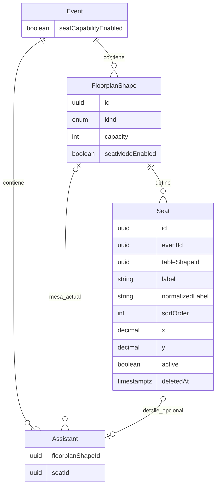

# ADR / Plan de implementacion - Capability opcional de asiento individual

Estado: **PROPUESTO - requiere aprobacion humana antes de codigo**  
Fecha: 2026-08-09  
Alcance: Fase 5 de Croquis Sticker  
Decision relacionada: `FLOORPLAN_STICKER_SEATING_CONTRACT.md`

## 1. Resumen ejecutivo

Se propone incorporar asientos persistentes como una capability explicitamente opt-in en dos niveles:

1. el Evento habilita la capability;
2. cada Mesa decide individualmente si usa lugares con identidad propia.

La autoridad funcional existente no cambia:

```text
Assistant -> FloorplanShape(TABLE)
```

El asiento agrega precision y siempre depende de esa asignacion:

```text
Assistant -> FloorplanShape(TABLE) -> Seat opcional
```

Se propone una entidad `Seat`, pero no una entidad `SeatAssignment`. La asignacion vigente es estado actual en
`Assistant`; por lo tanto, el minimo modelo no duplicado agrega `Assistant.seatId` nullable y lo protege mediante
una FK compuesta, unicidad parcial y triggers PostgreSQL.

En una Mesa sin asientos habilitados, `FloorplanShape.capacity` sigue siendo la autoridad. En una Mesa con asientos
habilitados, los `Seat` activos pasan a ser la autoridad y `FloorplanShape.capacity` queda como proyeccion
sincronizada obligatoriamente igual a su conteo. Los endpoints actuales de asignacion por Mesa siguen siendo
validos y sus payloads actuales conservan exactamente su significado.

Esta propuesta no autoriza implementacion. En particular, no se debe modificar Prisma, migraciones, OpenAPI,
Client ni Scanner hasta que las decisiones de la seccion 18 sean aceptadas.

## 2. Contexto y modelo actual auditado

### 2.1 Autoridad y persistencia actuales

- `Event.floorplanEnabled`, con default `false`, decide si el Evento usa Croquis.
- Existe un `Floorplan` activo por Evento y sus elementos son `FloorplanShape`.
- Una Mesa es `FloorplanShape.kind=TABLE`; una Zona es `DECORATIVE_ZONE`.
- `Assistant.floorplanShapeId` nullable referencia de forma compuesta una shape del mismo Evento.
- No existen `Seat`, `SeatAssignment` ni un modo de asignacion individual persistente.
- La ocupacion de Mesa es la suma de Asistentes activos y `PhysicalPass` activos asignados a ella.
- `SeatingOperation` conserva accion, llave global de idempotencia, firma de request y snapshot de respuesta.
- La auditoria de seating usa el agregado `FLOORPLAN` y se confirma en la misma transaccion que la mutacion.
- `seating.updated` se publica despues del commit mediante la infraestructura realtime existente.

### 2.2 Flujos de seating vigentes

| Flujo | Resolucion autoritativa | Efecto actual |
| --- | --- | --- |
| `ASSIGN` | lista explicita de Assistant | asigna todos a una Mesa |
| `ASSIGN_FAMILY` | Asistentes confirmados de una Invitacion | asignacion atomica familiar |
| `ASSIGN_GROUP` | Asistentes confirmados del Grupo | asignacion atomica grupal |
| `UPDATE` | un Assistant | cambia o elimina su Mesa |

Todos bloquean Evento, Floorplan, Mesa destino y Asistentes; usan `Serializable`, reintentos acotados,
idempotencia por firma y snapshot, auditoria transaccional y publicacion post-commit. La reduccion o eliminacion
de una Mesa ocupada esta bloqueada tanto en servicio como en PostgreSQL.

### 2.3 RSVP, cancelacion y check-in

- El rechazo RSVP, la omision nominal y la cancelacion liberan `floorplanShapeId` atomicamente.
- Esas liberaciones producen `SEATING_IMPLICIT_RELEASE` y un unico `seating.updated` post-commit.
- Scanner valida el QR por Invitacion y registra check-in por Assistant.
- Cuando `floorplanEnabled=true`, Scanner exige Mesa operativa, pero no existe ni necesita asiento.
- La respuesta y el snapshot de check-in conservan solo `table: {id,name} | null`.
- Cambiar Mesa despues del check-in esta permitido en los estados actuales; se audita con `postCheckIn=true`.
- El replay de check-in devuelve el snapshot original y no reconsulta ubicacion o nombre actuales.

### 2.4 Physical QR y reportes

- `PhysicalPass` referencia directamente `FloorplanShape`; no crea `Assistant`.
- La capacidad fisica de Mesa suma Asistentes y pases.
- El reporte de asistencia guarda `tableName`; el reporte fisico guarda Mesa, estado y fecha de uso.
- Los reportes ya generados son snapshots inmutables sujetos a version de plantilla y retencion.

## 3. Riesgos encontrados

1. **Doble autoridad de capacidad.** Permitir editar `capacity` y Seats de forma independiente produciria
   divergencia aunque la UI intentara coordinarlos.
2. **Asignacion duplicada.** Una entidad `SeatAssignment` paralela a `Assistant.floorplanShapeId` agregaria dos
   estados actuales que tendrian que reconciliarse en cada RSVP, cancelacion, seating y check-in.
3. **Pertenencia cruzada.** Una FK simple `Assistant.seatId -> Seat.id` no demuestra que Seat, Mesa, Assistant y
   Evento coincidan.
4. **Carreras de ultimo lugar.** Dos asignaciones al mismo Seat, una reasignacion cruzada o una eliminacion
   concurrente requieren locks y unicidad fisica; validacion frontend no es suficiente.
5. **Desactivacion destructiva.** Borrar Seats al apagar la capability perderia labels, posiciones e IDs, y podria
   ocultar asignaciones si no existe una resolucion explicita.
6. **RSVP incompleto.** Los flujos que hoy liberan Mesa tambien deben limpiar asiento en la misma transaccion.
7. **Replay incompatible.** Cambiar la canonicalizacion de payloads antiguos invalidaria llaves ya persistidas en
   `SeatingOperation`.
8. **Snapshot Scanner.** Reescribir snapshots antiguos para agregar Seat rompería la idempotencia historica.
9. **PhysicalPass ambiguo.** Un pase ocupa capacidad de Mesa, pero no tiene identidad Assistant a la cual asociar
   un Seat.
10. **Realtime incompatible.** Agregar campos obligatorios al envelope v1 podria romper consumidores estrictos.
11. **Reportes historicos.** Agregar `seatLabel` a un dataset existente sin version nueva cambia el hash y el
   significado de snapshots ya generados.
12. **Soft delete ambiguo.** Usar `active` y `deletedAt` como sinonimos crearia estados imposibles; solo son
    aceptables si representan ciclos de vida distintos.
13. **Cambio de servicio incompatible.** Un Evento con Seats configurados no puede pasar silenciosamente a
    `PHYSICAL_QR` o `DEMO`; `EventsService.update()` debe bloquear el cambio hasta desactivar la capability.

## 4. Opciones de activacion evaluadas

### Opcion A - solo por Evento

Al activarse, todas las Mesas generan Seats.

Ventajas:

- un unico control UX;
- consulta global simple.

Desventajas:

- escritura masiva y potencialmente costosa;
- obliga complejidad en Mesas que no la necesitan;
- desactivacion y migracion son de gran radio;
- contradice progressive disclosure para Eventos mixtos.

### Opcion B - solo por Mesa

La presencia/configuracion de Seats determina el modo sin capability de Evento.

Ventajas:

- modelo local y granular;
- menor numero de columnas.

Desventajas:

- la UX no tiene una declaracion explicita de intencion del Evento;
- es mas dificil distinguir configuracion accidental de capability autorizada;
- Scanner, reportes y permisos deben inferir capacidad global por existencia de filas;
- no existe un kill switch de Evento seguro.

### Opcion C - capability de Evento + habilitacion por Mesa

`Event.seatCapabilityEnabled` habilita el producto y `FloorplanShape.seatModeEnabled` selecciona las Mesas.

Ventajas:

- default inequívoco en modo Mesa para Eventos existentes y nuevos;
- progressive disclosure real;
- migracion gradual por Mesa;
- proyecciones pueden saber si deben consultar Seats sin inferencias;
- desactivacion controlada en dos pasos.

Desventajas:

- agrega dos flags y reglas de consistencia;
- requiere bloquear que una Mesa quede habilitada si el Evento se deshabilita.

### Decision propuesta

Adoptar **Opcion C**. Ambos flags tendran default `false`. Activar la capability del Evento no crea Seats. La
creacion ocurre unicamente al habilitar una Mesa concreta.

Deshabilitar la capability del Evento solo se permite cuando ninguna Mesa conserva `seatModeEnabled=true`. Esto
evita una operacion masiva implicita y obliga a resolver cada Mesa de forma visible.

## 5. Esquema conceptual propuesto



`Seat` pertenece directamente a una Mesa `FloorplanShape(TABLE)`. No pertenece al Canvas global. Sus coordenadas
son locales a la Mesa antes de aplicar posicion, escala y rotacion de la shape.

## 6. Modelo Prisma propuesto, no implementado

Cambios conceptuales:

```prisma
model Event {
  seatCapabilityEnabled Boolean @default(false) @map("seat_capability_enabled")
  seats                 Seat[]
}

model FloorplanShape {
  seatModeEnabled Boolean @default(false) @map("seat_mode_enabled")
  seats           Seat[]
}

model Seat {
  id              String    @id @default(uuid()) @db.Uuid
  eventId         String    @map("event_id") @db.Uuid
  tableShapeId    String    @map("table_shape_id") @db.Uuid
  label           String?   @db.VarChar(40)
  normalizedLabel String?   @map("normalized_label") @db.VarChar(40)
  sortOrder       Int       @map("sort_order")
  x               Decimal   @db.Decimal(9, 8)
  y               Decimal   @db.Decimal(9, 8)
  active          Boolean   @default(true)
  createdAt       DateTime  @default(now()) @map("created_at") @db.Timestamptz(6)
  updatedAt       DateTime  @updatedAt @map("updated_at") @db.Timestamptz(6)
  deletedAt       DateTime? @map("deleted_at") @db.Timestamptz(6)

  event      Event          @relation(fields: [eventId], references: [id], onDelete: Restrict)
  table      FloorplanShape @relation(fields: [tableShapeId, eventId], references: [id, eventId], onDelete: Restrict)
  assistants Assistant[]

  @@unique([id, eventId, tableShapeId])
  @@index([tableShapeId, active, deletedAt, sortOrder])
  @@index([eventId, active, deletedAt])
  @@map("seat")
}

model Assistant {
  seatId String? @map("seat_id") @db.Uuid
  seat   Seat?   @relation(fields: [seatId, eventId, floorplanShapeId], references: [id, eventId, tableShapeId], onDelete: Restrict)
}
```

La sintaxis Prisma exacta debe validarse durante implementacion; PostgreSQL sigue siendo autoridad para indices
parciales, constraints diferibles y triggers que Prisma no expresa.

### `active` frente a `deletedAt`

Ambos campos se justifican solo con semanticas distintas:

- `active=false`: configuracion preservada mientras el modo de la Mesa esta apagado; permite reactivar los mismos
  IDs, labels y posiciones;
- `deletedAt!=null`: identidad retirada de forma individual y no restaurada por una simple reactivacion.

Todo Seat eliminado debe quedar tambien `active=false`. Un Seat activo siempre tiene `deletedAt=null`.

### Por que no `SeatAssignment`

No se propone una tabla separada porque:

- el sistema actual modela la asignacion vigente directamente en `Assistant`;
- no existe una entidad `TableAssignment`; crear solo la variante Seat seria asimetrico;
- historial ya vive en auditoria y snapshots idempotentes;
- `Assistant.seatId` permite una FK compuesta que prueba Seat -> misma Mesa -> mismo Evento;
- una tabla intermedia agregaria joins, carreras y reconciliacion sin aportar una necesidad vigente.

Si en el futuro se requiere historial temporal consultable de ocupacion, reservas, múltiples ocupantes por lugar o
periodos de vigencia, se debera escribir otro ADR; no se debe anticipar esa complejidad ahora.

## 7. Posicion, labels e identidad

- El ID UUID es estable y nunca depende de label, orden o posicion.
- `sortOrder` inicia en `1..capacity` y es unico entre Seats no eliminados de la Mesa.
- Los labels iniciales son `1`, `2`, ..., `capacity`.
- `normalizedLabel` permite unicidad case-insensitive solo para labels no nulos y no eliminados.
- Renombrar o reordenar no cambia el ID.
- `x` y `y` usan el sistema local no rotado de la Mesa: `(0,0)` es la esquina superior izquierda y `(1,1)` la
  inferior derecha de su bounding box.
- Para permitir sillas alrededor del perimetro se propone el rango fisico `[-0.5, 1.5]` en ambos ejes.
- Mover, redimensionar o rotar la Mesa no reescribe Seats; el renderer aplica la transformacion de la shape.
- La distribucion inicial es determinista por geometria, capacidad y `sortOrder`, usando el mismo algoritmo visual
  ya caracterizado en F4, convertido al sistema local.

El rango local y la reutilizacion exacta del algoritmo F4 requieren aprobacion humana; cambiarlo despues exigiria
versionar o migrar posiciones.

## 8. Autoridad de capacidad e invariantes

### 8.1 Regla unica

```text
si table.seatModeEnabled = false:
  capacidad efectiva = table.capacity

si table.seatModeEnabled = true:
  capacidad efectiva = count(Seat active=true AND deletedAt IS NULL de la Mesa)
  y table.capacity DEBE ser exactamente igual a ese conteo
```

En modo Seat, `FloorplanShape.capacity` permanece en respuestas por compatibilidad, pero es una proyeccion
sincronizada. No puede modificarse independientemente mediante el PATCH legado.

### 8.2 Operaciones de capacidad

- Activar una Mesa crea exactamente `capacity` Seats sin cambiar la capacidad.
- Agregar un Seat crea la fila y aumenta `table.capacity` en la misma transaccion.
- Retirar un Seat reduce `table.capacity` en la misma transaccion.
- Un PATCH de shape que intente cambiar capacidad con `seatModeEnabled=true` responde conflicto.
- Un PATCH que repita la misma capacidad puede continuar para no romper editores que envian el valor completo.
- Reducir capacidad se bloquea si el Seat esta ocupado o si la ocupacion combinada de la Mesa quedaria por encima
  de la nueva capacidad.
- Eliminar o convertir la Mesa se bloquea mientras tenga Seats no eliminados; primero debe deshabilitarse el modo
  y resolverse su configuracion.

### 8.3 Invariantes fisicos

1. `Seat.tableShapeId` referencia una shape `TABLE`, activa, de Floorplan activo y mismo Evento.
2. Seat activo implica `Event.seatCapabilityEnabled=true`, `table.seatModeEnabled=true` y `deletedAt=null`.
3. Mesa con modo Seat implica capability de Evento activa.
4. Mesa con modo Seat implica `capacity = activeSeats` al commit.
5. `Assistant.seatId IS NOT NULL` implica `Assistant.floorplanShapeId IS NOT NULL`.
6. La FK compuesta obliga `Assistant.eventId = Seat.eventId` y
   `Assistant.floorplanShapeId = Seat.tableShapeId`.
7. Solo un Assistant activo puede referenciar un Seat mediante indice parcial unico.
8. Un Seat asignado no puede desactivarse ni eliminarse.
9. Un Seat inactivo o eliminado no puede asignarse.
10. Ocupacion combinada `active Assistants + active PhysicalPasses <= table.capacity` permanece vigente.
11. No se crea Seat para `DECORATIVE_ZONE`.
12. Ninguna regla de readiness exige que un Assistant con Mesa tenga Seat.
13. Capability Seat activa implica servicio `FLYER` o `FLIPBOOK`; cambiar a `PHYSICAL_QR`, `DEMO` o servicio nulo
    se bloquea hasta desactivarla explicitamente.

## 9. Activacion idempotente

### 9.1 Evento

Operacion propuesta:

```http
POST /api/v1/events/:eventId/seat-capability/enable
Idempotency-Key: <8..128>
```

- valida ownership y estados de seating actuales;
- exige `floorplanEnabled=true`, Floorplan activo y servicio `FLYER` o `FLIPBOOK`;
- bloquea Evento -> Floorplan;
- establece el flag sin crear Seats;
- registra `SEAT_CAPABILITY_ENABLE` una sola vez;
- guarda firma y snapshot en `SeatingOperation` con una accion enum aditiva;
- misma llave y payload devuelve snapshot; llave reutilizada de forma incompatible responde 409;
- una segunda llave cuando ya esta activo devuelve el estado actual sin crear auditoria ni filas adicionales.

### 9.2 Mesa

```http
POST /api/v1/events/:eventId/floorplan/shapes/:tableId/seats/enable
Idempotency-Key: <8..128>
```

Transaccion propuesta:

1. bloquear Evento -> Floorplan -> Mesa;
2. exigir capability del Evento, Mesa activa `TABLE` y layout desbloqueado;
3. verificar replay por llave/firma;
4. si existe configuracion inactiva reutilizable con exactamente `capacity` Seats no eliminados, reactivarla;
5. si no existe configuracion previa, crear exactamente `capacity` Seats con UUIDs, labels, orden y posiciones
   deterministas;
6. establecer `seatModeEnabled=true`;
7. validar invariantes diferibles;
8. persistir snapshot y auditorias dentro de la misma transaccion.

No se autoasignan Seats a Asistentes ya ubicados en la Mesa. Sus relaciones con Mesa permanecen intactas y el
detalle queda nullable hasta una asignacion explicita.

Activar dos veces, incluso con llaves distintas, no crea un segundo conjunto. Una configuracion inactiva cuyo
conteo ya no coincide con la capacidad requiere resolucion explicita y responde
`SEAT_CONFIGURATION_RECONCILIATION_REQUIRED`; no regenera silenciosamente IDs.

## 10. Desactivacion y reactivacion

### 10.1 Mesa

Operacion propuesta:

```http
POST /api/v1/events/:eventId/floorplan/shapes/:tableId/seats/disable
Idempotency-Key: <8..128>

{
  "assignmentResolution": "RETAIN_TABLE_CLEAR_SEATS"
}
```

Reglas:

- no existe desactivacion silenciosa;
- el valor de resolucion es obligatorio si hay al menos un Seat ocupado;
- omitirlo con ocupacion responde `SEAT_ASSIGNMENTS_RESOLUTION_REQUIRED` sin cambios;
- la resolucion permitida en Fase 5 limpia `Assistant.seatId`, nunca `floorplanShapeId`;
- todos los Seats no eliminados pasan a `active=false`, pero se preservan ID, label, orden y posicion;
- `seatModeEnabled` pasa a false y `capacity` conserva su valor;
- se auditan los IDs tecnicos y conteos, nunca nombres;
- se publica un unico `seating.updated` v1 post-commit para provocar recuperacion REST;
- la misma llave reproduce el snapshot sin repetir limpieza o auditoria.

La reactivacion reutiliza la configuracion preservada si su conteo coincide con la capacidad. Si la capacidad fue
editada durante modo Mesa, se exige una accion futura explicita de reconciliacion; Fase 5 no debe inferir si hay que
borrar, restaurar o crear identidades.

### 10.2 Evento

```http
POST /api/v1/events/:eventId/seat-capability/disable
Idempotency-Key: <8..128>
```

Solo se permite cuando todas las Mesas tienen `seatModeEnabled=false` y no existe `Assistant.seatId`. En caso
contrario responde `SEAT_CAPABILITY_TABLES_ACTIVE`. No archiva ni borra Seats; conserva configuraciones inactivas
para posible reactivacion posterior.

## 11. Integridad y estrategia de concurrencia

### 11.1 Constraints e indices PostgreSQL

- FK compuesta `seat(table_shape_id,event_id) -> floorplan_shape(id,event_id)` con `RESTRICT`;
- FK compuesta `assistant(seat_id,event_id,floorplan_shape_id) -> seat(id,event_id,table_shape_id)`;
- check `active = false OR deleted_at IS NULL`;
- check de label normalizado y `sort_order > 0`;
- check de coordenadas locales finitas dentro del rango aprobado;
- indice unico parcial por `(table_shape_id, sort_order)` para filas no eliminadas;
- indice unico parcial por `(table_shape_id, normalized_label)` para label no nulo y fila no eliminada;
- indice unico parcial `assistant(seat_id)` donde `seat_id IS NOT NULL AND deleted_at IS NULL`;
- constraint triggers diferibles que comprueben `capacity = activeSeats` al commit;
- triggers para capability Evento/Mesa, pertenencia, ocupacion y proteccion de Seat asignado;
- prechecks sin PII antes de instalar cada constraint.

### 11.2 Orden de locks

Todas las mutaciones nuevas usan `Serializable`, `CRITICAL_TRANSACTION_OPTIONS` y el orden:

```text
Event
-> Floorplan
-> FloorplanShape(TABLE), por UUID
-> Seat, por UUID/sortOrder
-> Invitation/Group si aplica
-> Assistant, por UUID
-> CheckIn activo, FOR SHARE cuando aplique
-> SeatingOperation
```

Para movimientos entre dos Mesas o dos Seats, ambos conjuntos se bloquean ordenados por UUID antes de escribir.
Esto evita swaps con orden inverso y mantiene compatibilidad con las carreras actuales.

### 11.3 Casos concurrentes obligatorios

- dos Assistants al mismo Seat: uno gana, otro recibe `SEAT_ALREADY_OCCUPIED`;
- mismo Assistant a dos Seats: serializa por Assistant y solo queda la ultima operacion ganadora segun locks;
- asignar contra retirar/desactivar Seat: nunca queda referencia a Seat no ocupable;
- agregar/retirar Seat contra PATCH de capacidad: no diverge capacidad;
- activar/desactivar Mesa contra asignacion: resultado completo en uno de los dos ordenes;
- mover Mesa/asiento despues de check-in contra reversal: conserva locks y snapshot estable;
- misma llave concurrente: una operacion, una auditoria, un snapshot;
- RSVP/cancelacion contra asignacion Seat: o se asigna antes y luego se libera, o la asignacion deja de ser elegible.

## 12. Ampliacion compatible de seating

### 12.1 Payloads existentes

Los cuatro payloads actuales siguen validos sin campos nuevos. Su comportamiento por defecto sera:

- asignar a una Mesa no asigna Seat;
- mover a otra Mesa limpia el Seat anterior;
- desasignar Mesa limpia tambien Seat;
- reasignar a la misma Mesa preserva el Seat actual;
- operaciones family/group preservan Seats solo para Assistants que ya estaban en esa misma Mesa; quienes cambian
  de Mesa pierden el detalle anterior;
- capacidad sigue contando Asistentes aunque no tengan Seat.

La canonicalizacion de requests sin campos Seat debe conservar la forma historica para que las firmas y replays
existentes no cambien.

### 12.2 Campos aditivos propuestos

- `AssignSeatingRequestDto.seatAssignments?`:
  `Array<{assistantId:string, seatId:string}>` para mapeo explicito;
- `AssignFamilyRequestDto.seatStrategy?`: `NONE | AUTO`, default por ausencia `NONE`;
- `AssignGroupRequestDto.seatStrategy?`: `NONE | AUTO`, default por ausencia `NONE`;
- `UpdateSeatingRequestDto.seatId?`: UUID o null; ausencia conserva la regla compatible anterior;
- `SeatingChangeDto.fromSeatId?` y `toSeatId?` como campos opcionales;
- `SeatingMutationResponseDto.seatChanges?` si se prefiere no mezclar el contrato base.

`AUTO` asigna en orden determinista por `Assistant.id` y `Seat.sortOrder`, solo a Seats activos y libres. Todo el
lote se confirma o revierte; nunca deja una familia o grupo parcialmente procesado por falta de lugar.

### 12.3 Cambios despues de check-in

Se propone conservar la politica actual: usuarios operativos autorizados pueden cambiar Mesa y Seat en estados
permitidos incluso despues del check-in. La mutacion debe incluir `postCheckIn=true` en auditoria. El snapshot de
check-in no se reescribe; su replay conserva la ubicacion entregada al momento del ingreso.

## 13. RSVP, invitacion familiar y QR

Seat no modifica:

- estado ni payload de RSVP;
- modo `INDIVIDUAL` o `FAMILY_NOMINAL`;
- limite o reconciliacion de acompañantes;
- identidad de Assistant;
- un QR por Invitacion;
- seleccion y check-in individual por Assistant.

Rechazo, omision nominal, eliminacion de Assistant y cancelacion deben limpiar `seatId` y
`floorplanShapeId` en la misma transaccion y en ese orden logico. La auditoria de liberacion agrega IDs Seat
opcionales, sin nombres. El QR nunca codifica Mesa ni Seat y su validez no depende de ellos.

## 14. Scanner y realtime

### 14.1 Impacto contractual Scanner

Se proponen campos exclusivamente aditivos:

```ts
type ScannerSeatDto = {
  id: string;
  label: string | null;
};

type PendingAssistantDto = {
  // campos actuales
  seat?: ScannerSeatDto | null;
};

type CheckedInAssistantDto = {
  // campos actuales
  seat?: ScannerSeatDto | null;
};
```

- Scanner muestra `MESA 14` cuando no existe Seat.
- Si existe, muestra `MESA 14 · ASIENTO 7`.
- Seat ausente nunca invalida un QR ni produce un blocker de check-in.
- Si `seatId` existe, el backend revalida Seat activo y compatible bajo los locks actuales.
- Snapshots nuevos pueden guardar `seat` opcional; snapshots antiguos sin ese campo siguen siendo validos.
- Scan/search proyectan ubicacion actual; replay de check-in conserva el snapshot historico.

### 14.2 Realtime

No se crea namespace, room, Socket.IO ni evento paralelo. `seating.updated` v1 permanece estructuralmente igual.
Una mutacion solo de Seat proyecta el mismo `fromTableId` y `toTableId`, mas la Mesa afectada, para que consumidores
existentes invaliden y recuperen por REST. Los campos Seat detallados permanecen en la respuesta REST y auditoria,
no en el envelope v1.

## 15. Physical QR y reportes

### 15.1 Physical QR

`PhysicalPass` no referencia `Assistant`, por lo que `Assistant.seatId` no puede representar su lugar. Ademas, un
Evento `PHYSICAL_QR` usa pases en vez del flujo nominal de Invitaciones/Asistentes.

Decision propuesta para Fase 5 inicial: **la capability Seat no aplica a Eventos `PHYSICAL_QR`** y el endpoint de
activacion responde `SEAT_CAPABILITY_SERVICE_UNSUPPORTED`. Pases conservan exclusivamente Mesa y su capacidad
combinada actual. No se agrega `seatId` a `PhysicalPass` en este ADR.

Permitir un asiento individual por pase seria otra decision de producto y requeriria revisar generacion masiva,
SVG, Scanner, transferencia, uso y reportes. No debe inferirse dentro de Fase 5.

### 15.2 Reportes

- Reportes existentes y snapshots ya generados no cambian.
- El reporte de pases fisicos permanece sin Seat.
- La primera implementacion de backend puede mantener el reporte de asistencia actual con solo `tableName`.
- Si producto exige mostrar Seat, debe hacerse en `ATTENDANCE` con una nueva `templateVersion`, agregando
  `seatLabel: string | null` solo al dataset detallado; el agregado permanece igual.
- Ningun reporte debe exponer `seatId` si el objetivo visible se satisface con label.

La inclusion de `seatLabel` en la primera entrega requiere aprobacion humana expresa.

## 16. OpenAPI y SDK propuestos, no modificados

### 16.1 Endpoints de capability y configuracion

| Metodo | Ruta | Idempotency-Key | Resultado |
| --- | --- | --- | --- |
| GET | `/events/:eventId/seat-capability` | no | estado y resumen |
| POST | `/events/:eventId/seat-capability/enable` | si | capability habilitada |
| POST | `/events/:eventId/seat-capability/disable` | si | capability deshabilitada |
| GET | `/events/:eventId/floorplan/shapes/:tableId/seats` | no | Seats de la Mesa |
| POST | `/events/:eventId/floorplan/shapes/:tableId/seats/enable` | si | configuracion activa |
| POST | `/events/:eventId/floorplan/shapes/:tableId/seats/disable` | si | configuracion inactiva |
| POST | `/events/:eventId/floorplan/shapes/:tableId/seats` | si | Seat creado + capacidad |
| PATCH | `/events/:eventId/floorplan/shapes/:tableId/seats/:seatId` | si | Seat actualizado |
| DELETE | `/events/:eventId/floorplan/shapes/:tableId/seats/:seatId` | si | Seat retirado + capacidad |

Las mutaciones Seat requieren llave porque cambian identidad/capacidad o producen efectos auditables. Aunque el
PATCH pueda repetirse naturalmente, usar la misma politica simplifica retries y concurrencia de configuracion.

### 16.2 DTOs principales

- `SeatCapabilityResponseDto`: `enabled`, `enabledTableCount`, `activeSeatCount`;
- `SeatResponseDto`: `id`, `tableShapeId`, `label`, `sortOrder`, `x`, `y`, `active`,
  `occupiedByAssistantId|null`, timestamps necesarios;
- `EnableTableSeatsResponseDto`: Mesa, capacidad, Seats y `replayed` si el patron del API lo autoriza;
- `DisableTableSeatsRequestDto`: `assignmentResolution?`;
- `CreateSeatRequestDto`: label opcional y posicion local; posicion omitida usa distribucion determinista;
- `UpdateSeatRequestDto`: label, orden y/o posicion;
- campos seating aditivos de la seccion 12;
- `ScannerSeatDto` opcional de la seccion 14.

`FloorplanResponseDto` agrega `seatCapabilityEnabled` y cada Mesa agrega `seatModeEnabled` y un resumen
`activeSeats/assignedSeats`. La lista detallada no se embebe en todas las shapes para evitar inflar Croquis masivos;
se consulta por Mesa.

El SDK se regenera exclusivamente desde OpenAPI. No se escriben tipos duplicados manualmente.

### 16.3 Errores estables propuestos

- `SEAT_CAPABILITY_DISABLED`;
- `SEAT_CAPABILITY_SERVICE_UNSUPPORTED`;
- `SEAT_CAPABILITY_TABLES_ACTIVE`;
- `SEAT_MODE_ALREADY_ENABLED` solo si no se adopta idempotencia por estado;
- `SEAT_CONFIGURATION_RECONCILIATION_REQUIRED`;
- `SEAT_NOT_FOUND`;
- `SEAT_TABLE_INVALID`;
- `SEAT_ALREADY_OCCUPIED`;
- `SEAT_NOT_ACTIVE`;
- `SEAT_ASSIGNMENT_TABLE_MISMATCH`;
- `SEAT_ASSIGNMENTS_RESOLUTION_REQUIRED`;
- `SEAT_CAPACITY_AUTHORITY_CONFLICT`;
- `SEAT_IDEMPOTENCY_CONFLICT`.

No se reutilizan errores de QR/Scanner para fallos de configuracion Seat.

## 17. Estrategia de migracion

### 17.1 Migracion PostgreSQL propuesta

1. agregar valores aditivos a `seating_action` para capability, configuracion y asignacion Seat;
2. agregar `event.seat_capability_enabled BOOLEAN NOT NULL DEFAULT FALSE`;
3. agregar `floorplan_shape.seat_mode_enabled BOOLEAN NOT NULL DEFAULT FALSE`;
4. crear tabla `seat` con FKs, checks e indices;
5. agregar `assistant.seat_id UUID NULL`;
6. ejecutar prechecks: flags false, `seat_id` nulo, cero Seats y ausencia de datos cruzados;
7. instalar FK compuesta e indice unico parcial de ocupacion;
8. instalar triggers de pertenencia, capability, capacidad, ocupacion y borrado;
9. reemplazar cuidadosamente triggers actuales de Mesa/Assistant sin perder ocupacion combinada de PhysicalPass;
10. validar constraints y ejecutar pruebas PostgreSQL sobre una base migrada desde el estado anterior.

### 17.2 Datos existentes

- no se crean Seats por backfill;
- todos los Eventos quedan `seatCapabilityEnabled=false`;
- todas las Mesas quedan `seatModeEnabled=false`;
- todos los `Assistant.seatId` quedan nulos;
- `Assistant.floorplanShapeId`, PhysicalPass, CheckIn, reportes y snapshots no se reescriben;
- Eventos nuevos tambien comienzan en modo Mesa por defaults de base y aplicacion.

### 17.3 Rollback

El rollback operativo preferido es **forward-compatible**:

- desplegar aplicacion anterior manteniendo columnas/tablas nuevas sin uso;
- bloquear nuevas activaciones mediante feature flag de despliegue;
- deshabilitar Mesas con resolucion explicita y luego capability del Evento;
- no borrar datos Seat durante el rollback inmediato.

Un rollback fisico que elimine tabla/columnas solo se ejecuta despues de comprobar:

- cero `seat_mode_enabled=true`;
- cero `seat_capability_enabled=true`;
- cero `assistant.seat_id` no nulos;
- export o aceptacion explicita de perdida de configuraciones Seat preservadas.

No se propone downgrade automatico destructivo.

## 18. Auditoria minima

| Accion | Resource type | Datos permitidos |
| --- | --- | --- |
| `SEAT_CAPABILITY_ENABLE` | `SEAT_CAPABILITY` | eventId |
| `SEAT_CAPABILITY_DISABLE` | `SEAT_CAPABILITY` | eventId |
| `TABLE_SEAT_MODE_ENABLE` | `FLOORPLAN` | tableId, seatCount |
| `TABLE_SEAT_MODE_DISABLE` | `FLOORPLAN` | tableId, clearedAssignmentCount |
| `SEAT_CREATE` | `SEAT` | seatId, tableId, label tecnico, posicion |
| `SEAT_UPDATE` | `SEAT` | before/after sin PII |
| `SEAT_DELETE` | `SEAT` | seatId, tableId |
| `SEAT_ASSIGN` | `SEAT` | assistantId, tableId, seatId |
| `SEAT_REASSIGN` | `SEAT` | assistantId, fromSeatId, toSeatId |
| `SEAT_UNASSIGN` | `SEAT` | assistantId, fromSeatId, tableId |

Cada mutacion produce una auditoria agregada por request, no una por fila en bulk salvo que el patron vigente lo
requiera. No se registran nombres de Assistant, Invitacion, Contacto, telefono, QR ni secretos.

## 19. Matriz QA propuesta

### Unitarias

- DTOs estrictos, labels, orden y coordenadas locales;
- canonicalizacion compatible de payloads antiguos;
- firmas deterministas para nuevos campos;
- distribucion inicial por geometria;
- proyecciones Mesa/Seat y snapshots viejos/nuevos.

### Integracion PostgreSQL

- migracion desde base con Eventos y Mesas existentes;
- cero backfill y defaults false;
- FK compuesta Evento/Mesa/Seat/Assistant;
- unicidad parcial de ocupacion, orden y label;
- triggers contra Seat de Zona, Mesa eliminada, Floorplan ajeno y Seat inactivo;
- igualdad diferible `capacity=activeSeats`;
- conservacion de ocupacion combinada Assistant + PhysicalPass;
- bloqueo de eliminar Seat ocupado o reducir bajo ocupacion;
- proteccion ante SQL directo y rollback de auditoria.

### Concurrencia

- todos los casos de la seccion 11.3 con barreras sobre locks reales;
- ambos ordenes ganadores para activar/desactivar/asignar/retirar;
- swaps de Seats y Mesas sin deadlock persistente;
- misma llave y llaves distintas concurrentes;
- RSVP/cancelacion/check-in/reversal contra Seat.

### Idempotencia

- replay exacto despues de cambios posteriores;
- conflicto por reutilizacion de llave/payload;
- doble activacion no duplica Seats;
- doble desactivacion no repite auditoria;
- fallo de red despues de commit recupera snapshot sin repetir mutacion.

### OpenAPI/SDK

- generacion reproducible y `generate:check`;
- payloads actuales siguen compilando;
- campos nuevos son aditivos/opcionales donde hay snapshots historicos;
- runtime guards aceptan respuestas viejas y nuevas.

### Scanner regression

- Evento Mesa existente conserva `MESA 14`;
- Evento Seat muestra `MESA 14 · ASIENTO 7`;
- ausencia de Seat no bloquea QR/check-in;
- Seat invalido persistido se rechaza por integridad, no por frontend;
- replay antiguo sin Seat y nuevo con Seat;
- realtime v1 sigue parseando y REST recupera detalle.

### Reportes y PhysicalPass

- snapshots existentes no cambian;
- reporte v1 mantiene Mesa;
- si se aprueba template v2, Seat solo aparece como label nullable;
- PhysicalPass permanece por Mesa y sus carreras de capacidad siguen verdes;
- activacion Seat en `PHYSICAL_QR` aplica la decision humana aprobada.

### Gates

```bash
pnpm format:check
pnpm lint
pnpm typecheck
pnpm test
pnpm build
pnpm --filter @invitaciones/api db:validate
pnpm --filter @invitaciones/api test:integration
pnpm --filter @invitaciones/api openapi:generate
pnpm generate:check
```

Ademas se debe aplicar la migracion desde una copia con datos F0-F4 y probar rollback operativo.

## 20. Plan de implementacion en PRs pequeños

### PR 5.0 - ADR y aprobacion

- este documento;
- decisiones humanas cerradas;
- cero cambios ejecutables.

### PR 5.1 - Esquema e integridad PostgreSQL

- Prisma y una migracion;
- `Seat`, flags y `Assistant.seatId`;
- constraints, triggers e indices;
- pruebas de migracion, SQL directo y concurrencia de capacidad;
- sin endpoints ni frontend.

### PR 5.2 - Capability y catalogo Seat en API

- activar/desactivar Evento y Mesa;
- CRUD Seat;
- idempotencia mediante `SeatingOperation` extendido;
- auditoria;
- pruebas de ownership, estados, lock y replay;
- sin cambiar Scanner.

### PR 5.3 - Seating Seat-aware

- campos aditivos en `ASSIGN`, `ASSIGN_FAMILY`, `ASSIGN_GROUP`, `UPDATE`;
- asignacion explicita y autoasignacion atomica;
- liberaciones RSVP/cancelacion/eliminacion;
- post-check-in y realtime v1 como invalidacion;
- matriz de carreras completa.

### PR 5.4 - OpenAPI y SDK

- DTOs y endpoints documentados;
- regeneracion exclusiva desde OpenAPI;
- pruebas de drift y compatibilidad de payloads anteriores.

### PR 5.5 - Proyeccion Scanner

- Seat opcional en REST y snapshots nuevos;
- render contractual `MESA · ASIENTO`;
- QR/check-in sin requisito Seat;
- regresiones Scanner, QR y realtime;
- sin nueva infraestructura realtime.

### PR 5.6 - Reporte de asistencia, solo si se aprueba

- nueva templateVersion detallada con `seatLabel` nullable;
- snapshots anteriores intactos;
- regresion de retencion, PDF y reportes fisicos.

### PR posterior - Client / Split View

No forma parte de la autorizacion backend de este ADR. Debe iniciarse solo cuando PRs 5.1-5.5 esten aceptados y
con su propio plan UX, manteniendo F0-F4 congeladas.

## 21. Consecuencias

### Positivas

- compatibilidad total con asignacion por Mesa;
- opt-in visible y granular;
- una sola asignacion actual en Assistant;
- IDs Seat estables y configuracion reactivable;
- invariantes defendidas en PostgreSQL;
- Scanner y realtime evolucionan aditivamente.

### Negativas

- dos flags de capability que requieren constraints;
- triggers y locks adicionales en rutas de RSVP/seating/check-in;
- desactivar exige resolucion explicita y no es una accion trivial;
- `capacity` conserva dos roles contractuales segun el modo, aunque existe una unica autoridad por modo;
- posiciones locales requieren congelar un convenio geometrico.

## 22. Decisiones que requieren aprobacion humana

La implementacion permanece bloqueada hasta aprobar o enmendar expresamente:

1. **Activacion hibrida:** capability por Evento + habilitacion individual por Mesa.
2. **Modelo minimo:** entidad `Seat` + `Assistant.seatId`; sin `SeatAssignment`.
3. **Capacidad:** Seats activos mandan en modo Seat y `FloorplanShape.capacity` es proyeccion sincronizada.
4. **Desactivacion:** limpiar solo detalle Seat, conservar Mesa y mantener configuracion inactiva con los mismos IDs.
5. **Reactivacion:** reutilizar configuracion solo si su conteo coincide; cualquier divergencia exige resolucion.
6. **Posicion local:** coordenadas `x/y` relativas a Mesa en rango `[-0.5,1.5]`.
7. **Asignaciones existentes:** activar no autoasigna Seats y ausencia de Seat nunca cambia readiness/check-in.
8. **Post-check-in:** permitir cambio de Seat con auditoria, conservando inmutable el snapshot original.
9. **Physical QR:** excluir Seat de Fase 5 y rechazar capability en Eventos `PHYSICAL_QR`.
10. **Scanner realtime:** conservar envelope `seating.updated` v1 como invalidacion sin detalle Seat.
11. **Reportes:** decidir si `seatLabel` se difiere o se agrega mediante `ATTENDANCE templateVersion` nueva.
12. **Secuencia de PRs:** aprobar primero persistencia/integridad, despues API, seating, SDK y finalmente Scanner.

Hasta resolver estos puntos, el estado del ADR permanece **Propuesto** y no debe iniciarse PR 5.1.
